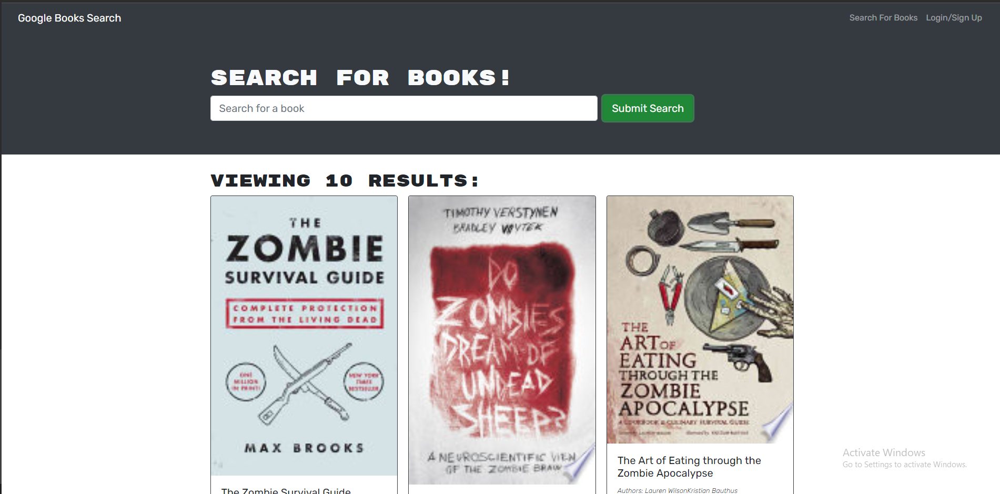

# MERN Book Search

## Developed By: Troy Grossi

### Deployed URL: https://tjg-book-search.herokuapp.com/

 
 

# Description

This is a challenge assignment provided by Trilogy under the UC Berkley coding bootcamp. The challange of this assignmnet is to convert a MERN based web application from REST API structure to instead mutate and query requests through graphql. The web application must then meet the following criteria:
- GIVEN a book search engine
- WHEN I load the search engine
- THEN I am presented with a menu with the options Search for Books and Login/Signup and an input field to search for books and a submit button
- WHEN I click on the Search for Books menu option
- THEN I am presented with an input field to search for books and a submit button
- WHEN I am not logged in and enter a search term in the input field and click the submit button
- THEN I am presented with several search results, each featuring a book’s title, author, description, image, and a link to that book on the Google Books site
- WHEN I click on the Login/Signup menu option
- THEN a modal appears on the screen with a toggle between the option to log in or sign up
- WHEN the toggle is set to Signup
- THEN I am presented with three inputs for a username, an email address, and a password, and a signup button
- WHEN the toggle is set to Login
- THEN I am presented with two inputs for an email address and a password and login button
- WHEN I enter a valid email address and create a password and click on the signup button
- THEN my user account is created and I am logged in to the site
- WHEN I enter my account’s email address and password and click on the login button
- THEN I the modal closes and I am logged in to the site
- WHEN I am logged in to the site
- THEN the menu options change to Search for Books, an option to see my saved books, and Logout
- WHEN I am logged in and enter a search term in the input field and click the submit button
- THEN I am presented with several search results, each featuring a book’s title, author, description, image, and a link to that book on the Google Books site and a button to save a book to my account
- WHEN I click on the Save button on a book
- THEN that book’s information is saved to my account
- WHEN I click on the option to see my saved books
- THEN I am presented with all of the books I have saved to my account, each featuring the book’s title, author, description, image, and a link to that book on the Google Books site and a button to remove a book from my account
- WHEN I click on the Remove button on a book
- THEN that book is deleted from my saved books list
- WHEN I click on the Logout button
- THEN I am logged out of the site and presented with a menu with the options Search for Books and Login/Signup and an input field to search for books and a submit button  

# Table of Contents

- [Installation](#installation)

- [Usage](#usage)

- [Contribution](#contribution)

- [License](#license)

<!---->

- [Questions](#questions)

# Installation

1) Download the project from github. 
2) Must have node, mongo db, and npm installed and configured on your client. 
3) Type "npm install" from the root of the server directory and the client directory. 
- Note, npm install must be done in both directories in order to install all required dependencies.  
6) The client side .env file must contain a variable called REACT_APP_API_KEY. The REACT_APP_API_KEY variable must equal your unique api key from https://rawg.io/apidocs 
7) Begin launching the app by first typing (npm start) in the terminal from the root of the server directory
8) Then, type (npm start) in the terminal from the root of the client directory

### Dependencies: 
#### Root:
- concurrently
#### Client Side:
- apollo/client
- testing-library/jest-dom
- testing-library/react
- testing-library/user-event
- bootstrap
- graphql
- jwt-decode
- react1
- react-bootstrap
- react-dom1
- react-router-dom
- react-scripts
#### Server Side:
- apollo-server-express
- bcrypt
- dotenv
- express
- graphql
- jsonwebtoken
- mongoose

# Usage
### Operator:
- Begin launching the app by first typing (npm start) in the terminal from the root of the server directory
- Then, type (npm start) in the terminal from the root of the client directory
- Navigate to  http://localhost:3000 in the browser to access the application user interface
- Navigate to http://localhost:3001/graphql in the browser to access the graphql interface
### Client:
- The Home page will display a search feature to search for books using the book search API
- The user can search for gbooks by name by typing them in the search bar at the top of the page
- Based on their search, a list of similar book titles will render for the user to view
- The user can sign up by clicking the navigation menu on the upper right and selecting the signup link
- The user can sign in by clicking the navigation menu on the upper right and selecting the login link. 
- Once the user is logged in, they have the ability to save books to their profile, as well as, delete books from their profile

<!---->

Screenshot:

<!---->

# Contribution

Refer to:
[Contribution Convenant](https://www.contributor-covenant.org/version/2/0/code_of_conduct/code_of_conduct.md)

# License

MIT

# Questions

Ask questions at github

- GitHub Link: https://github.com/troygrossi/Book-Search-Engine-MongoDB